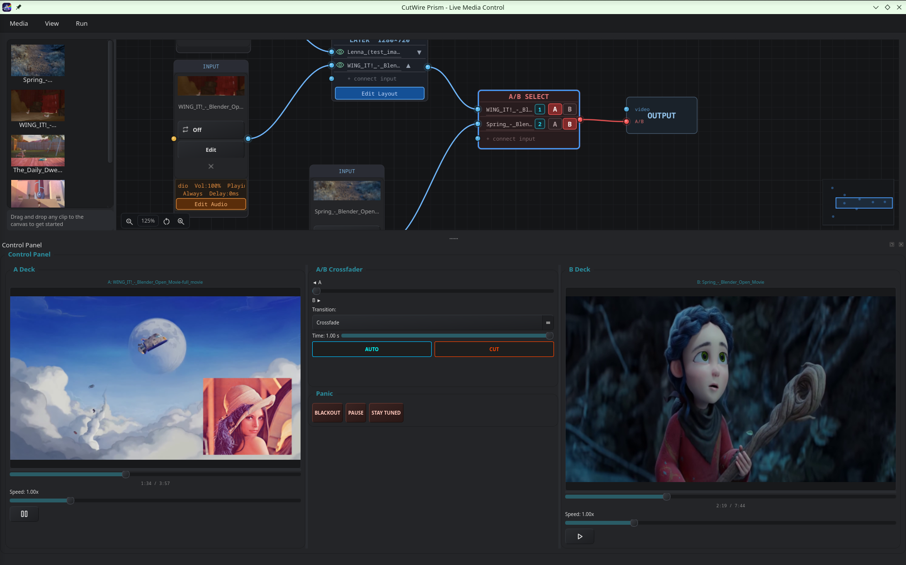
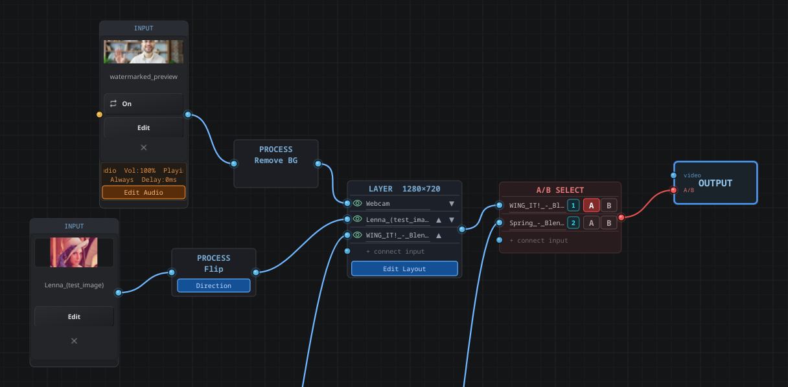
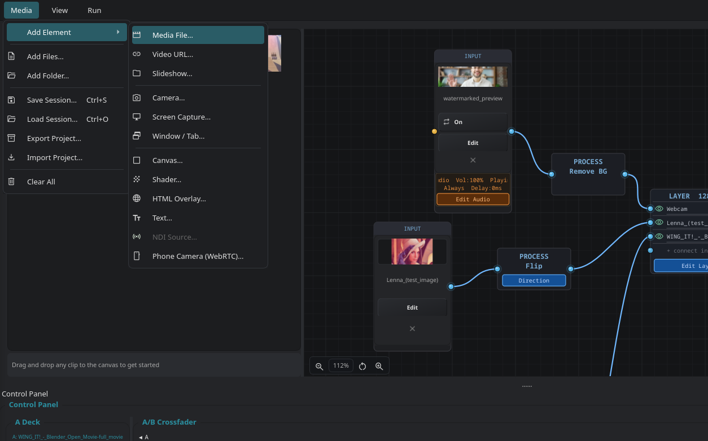
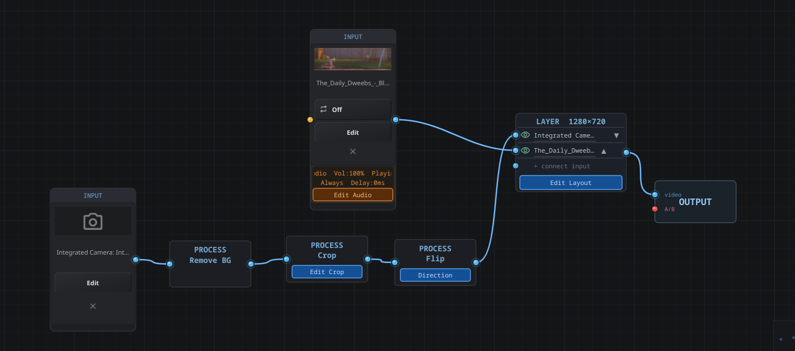
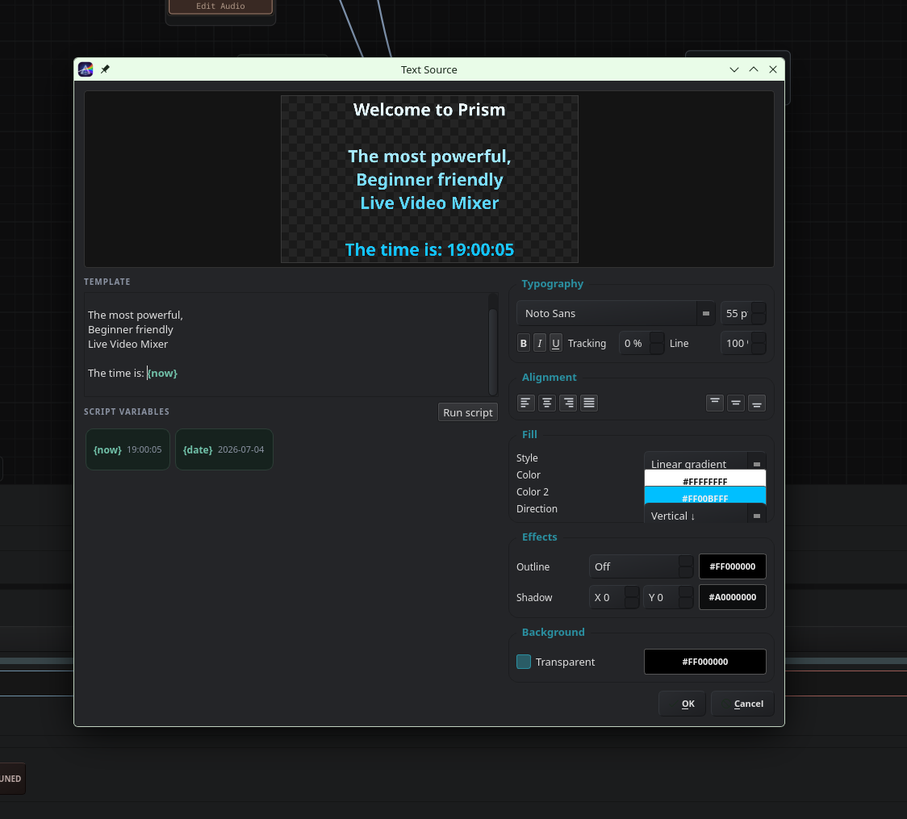
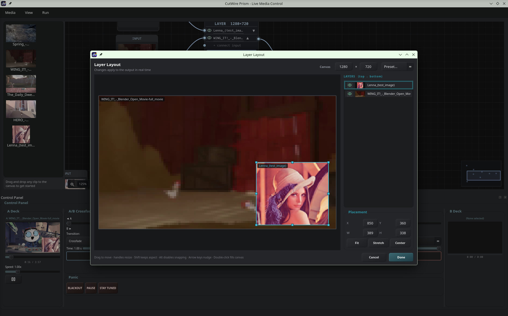
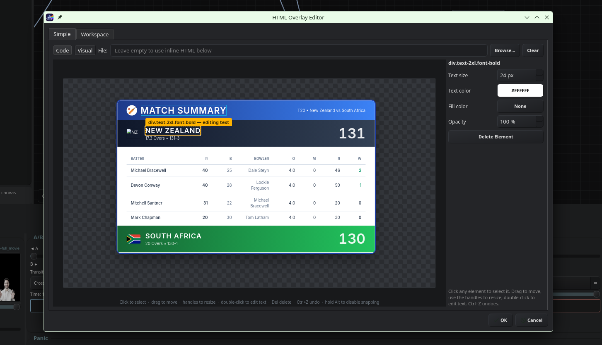
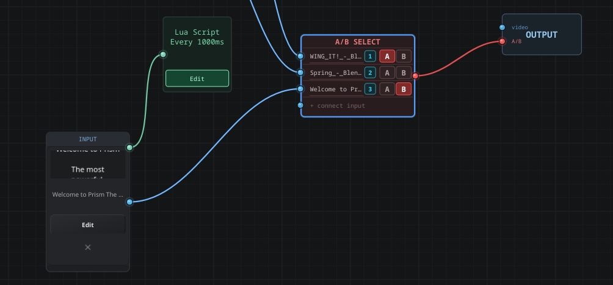
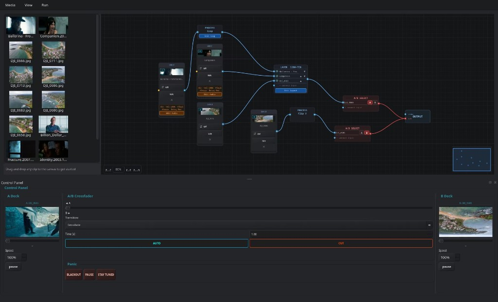

<p align="center">
  
</p>

<h1 align="center">CutWire Prism</h1>

<p align="center">
  A beginner-friendly live media trigger and overlay tool built with Qt 6, FFmpeg, and OpenGL.<br>
  Perfect for school events, small concerts, and sports—combining the simplicity of instant clip triggering with the power of live visual control.
</p>

<p align="center">
  <a href="LICENSE"></a>
  
</p>

<p align="center">
  <strong>CutWire Prism is free and open source (GPLv3).</strong>
</p>

<p align="center">
  <a href="https://github.com/CutWire-Studios/Prism">GitHub</a> ·
  <a href="https://github.com/CutWire-Studios/Prism/issues">Issues</a> ·
  <a href="LICENSE">License</a>
</p>

## Features

- **Node Graph Canvas**: Free-form visual pipeline — wire **Input → Process → Layer → A/B Select → Output** nodes; zoom, pan, and minimap for large shows
- **Process & Layer Nodes**: Crop, flip, and ML background removal in Process nodes; stack and layout multiple inputs in Layer nodes with canvas sizing and transform editing
- **AI Background Removal**: Remove-Background process node runs MediaPipe's selfie-segmentation model (via ONNX Runtime) to key out a webcam's background live, compositing the subject over the layers below
- **Multiple Media Source Types**: Video files, images, slideshows, webcams, screen/window capture, custom canvases, GLSL shaders, HTML/QML overlays, text, NDI inputs, and phone cameras (WebRTC)
- **Live A/B Deck Mixing**: Crossfade between two decks with per-deck speed, **AUTO** / **CUT**, and many transition modes (wipes, slides, dips, 3D cube/flip, and more)
- **Master Audio Routing**: Master audio-input and master audio-output nodes for per-device capture and mixing inside the graph
- **Asset Library**: Reusable sidebar of imported media — drag assets onto the node canvas or double-click to add files
- **Dockable Control Panel**: Deck previews, crossfader, transitions, and panic controls in a dock widget that can be floated or repositioned
- **Source Editing**: Per-input trim, crop, transform, and composited text/image overlays via dedicated edit dialogs
  - **Trim**: Set in/out points with frame-accurate playback preview
  - **Crop**: Visual move/resize crop selector with numeric spinbox controls
  - **Base Canvas**: Drag/resize the source inside a fixed canvas
  - **Overlays**: Composited text and image overlays with font size, color, opacity, and visibility controls
- **GLSL Shader Sources**: Built-in visual generators plus custom fragment shaders, including audio-reactive presets
- **HTML / QML Overlays**: Dynamic scoreboards, clocks, and countdown timers via Qt WebEngine
- **Lua Scripting**: Script nodes that generate live text/data overlays via an embedded Lua runtime (sol2, optional at build time)
- **Phone Camera (WebRTC)**: Stream a smartphone camera into CutWire Prism over LAN or a public relay, paired by QR code
- **Audio FFT Visualization**: Real-time spectrum analysis with kissfft-driven shader inputs
- **Hotkey Grid**: Keyboard trigger map (1–0, Q–P, A–L, Z–M); bare key → Deck A, Shift+key → Deck B
- **Session & Project Management**: Save/load sessions, autosave, smart asset relinking, and portable `.prism` project export/import
- **Panic Controls**: Emergency **Blackout**, **Pause** (freeze on current frame), and **Stay Tuned** overlay
- **Program Output Hub**: Mirror windows, optional NDI program output, virtual-camera output, program video recording with markers, FLAC program-audio recording, and freeze-frame capture
- **OBS Integration**: Optional WebSocket connection for scene switching and per-source OBS scene links
- **Remote Control**: Built-in server for triggering sources and decks from another device on the network
- **Real-time Playback**: FFmpeg-powered video decoding with low-latency OpenGL compositing
- **Drag & Drop**: Import media into the asset library or drop files directly onto the node canvas
- **Dark VJ Theme**: Charcoal UI with teal accents, optimized for low-light live events

## Screenshots

<p align="center">
  
</p>

<p align="center"><em>The main window — asset library, node graph canvas, and control panel</em></p>

<table>
  <tr>
    <td width="50%">
      <br>
      <sub>Wiring inputs, effects, and outputs on the node graph canvas</sub>
    </td>
    <td width="50%">
      <br>
      <sub>Choosing from many supported media source types</sub>
    </td>
  </tr>
  <tr>
    <td width="50%">
      <br>
      <sub>Applying live video effects in a process node</sub>
    </td>
    <td width="50%">
      <br>
      <sub>Compositing animated text overlays onto a source</sub>
    </td>
  </tr>
  <tr>
    <td width="50%">
      <br>
      <sub>Editing composited text and image overlays</sub>
    </td>
    <td width="50%">
      <br>
      <sub>Designing dynamic HTML overlays in the built-in visual editor</sub>
    </td>
  </tr>
  <tr>
    <td width="50%">
      <br>
      <sub>Generating live overlays with the embedded Lua scripting runtime</sub>
    </td>
    <td width="50%"></td>
  </tr>
</table>

## Architecture

### UI Layout

<p align="center">
  
</p>

The main window is split into three areas:

1. **Asset library** (left) — imported media thumbnails; drag clips onto the node canvas or double-click to add files
2. **Node graph canvas** (center) — visual pipeline of Input, Process, Layer, A/B Select, and Output nodes
3. **Control panel** (bottom dock) — A/B deck previews, crossfader, transition controls, and panic buttons

Program output opens in a separate window (mirror, NDI, virtual camera, or recording).

### Tech Stack

| Layer | Technology |
|-------|-----------|
| Framework | Qt 6 Widgets — cross-platform GUI |
| Video Decode | FFmpeg (libavcodec, libavformat, libavutil, libswscale, libswresample) |
| Rendering | OpenGL via `QOpenGLWidget` |
| Camera / Screen | Qt Multimedia; Linux screen capture uses PipeWire portal + GStreamer; Windows/macOS use `QScreenCapture` / `QWindowCapture` |
| Web Overlays | Qt WebEngine |
| Scripting | Lua 5.4 + sol2 (optional) |
| Audio Analysis | kissfft (FFT spectrum for shaders) |
| Background Removal | ONNX Runtime + MediaPipe selfie-segmentation model (optional) |
| Pattern Matching | RE2 |
| Session Bundles | libzip (portable `.prism` packages) |
| Streaming Output | NDI SDK (optional) |
| Phone Camera | libdatachannel (WebRTC) + OpenSSL + Qt WebSockets (optional) |
| OBS / Remote Control | Qt WebSockets / Qt Network (optional) |
| QR Codes | vendored qrcodegen (`third_party/`) |
| Build System | CMake 3.16+, C++20 |
| License | GPLv3 (compatible with FFmpeg GPL) |

## Project Structure

Headers live under `include/` and implementations under `src/`, mirroring the
same `core/` and `ui/` subtree layout. Code is built into a `prism_core`
static library that both the `CutWire Prism` app and the unit tests link against.

```
src/
  ├── main.cpp
  ├── core/
  │   ├── sources/        # MediaSource interface + every source type
  │   │     VideoFileSource, ImageSource, SlideshowSource, CameraSource,
  │   │     ScreenSource, WindowCaptureSource, CanvasSource, ShaderSource,
  │   │     HtmlSource/HtmlWorkspace, TextSource, NdiSource, WebRtcSource
  │   ├── media/          # VideoPlayer, AudioDecoder, AudioPlayer,
  │   │                   # AudioAnalyzer (FFT), ThumbnailExtractor
  │   ├── project/        # ClipManager, OverlayItem, AssetPathResolver,
  │   │                   # ProjectPackager (portable .prism session bundles)
  │   ├── scripting/      # Lua script runtime (sol2) for Script nodes
  │   └── webrtc/         # Phone-camera signaling, pairing, TLS, RTP depack
  └── ui/
      ├── mainwindow/     # MainWindow, DeckController, SourceFactory/Prompt
      ├── nodes/          # ClipNodeEditor, ClipNodeModel, ClipCard, ClipEditDialog
      ├── canvas/         # VideoWidget (OpenGL), crop/transform/group editors,
      │                   # HTML preview & workspace canvas
      ├── editors/        # Shader / HTML / Script / Text edit dialogs
      ├── transitions/    # Crossfader and transition logic
      ├── output/         # OutputHub, OutputWindow, mirror windows,
      │                   # NDI + virtual-camera program sinks
      ├── recording/      # ProgramRecorder and recording settings
      ├── obs/            # OBS WebSocket scene control
      ├── hotkeys/        # VJ hotkey grid + editor
      ├── remote/         # Remote control server + protocol
      ├── session/        # Session save/load, autosave, recovery dialog
      └── common/         # AssetLibrary, ThumbHelper, MaterialSymbols, QrCodeHelper

include/                  # Public headers, mirroring the src/ subtree
forms/                    # Qt Designer .ui files
third_party/qrcodegen/    # Vendored QR code generator (WebRTC pairing)
third_party/softcam/      # Windows virtual-camera backend (fetched + built)
scripts/                  # webrtc_signaling_server.py (relay), build-windows.ps1
tests/                    # Qt Test unit tests (linked against prism_core)
docs/                     # webrtc-phone-camera.md and other notes
resources/
  ├── styles/dark.qss     # Dark VJ theme stylesheet
  ├── fonts/              # Material Symbols icon font
  ├── shaders/            # Built-in GLSL presets + slideshow transitions
  ├── scripts/            # Sample Lua scripts (clock, counter, …)
  ├── html/               # HTML overlay templates
  └── qml/                # QML overlay templates

flatpak/                  # Flatpak packaging (org.cutwire.Prism)
CMakeModules/             # FindFFmpeg / FindNDI / Findre2
.github/workflows/        # GitHub Actions CI (build.yml, flatpak.yml)
```

## Design Philosophy

CutWire Prism prioritizes **simplicity over features**. Every button should feel intuitive even for users touching VJ software for the first time. Unlike Resolume Arena (complex, $$$) or TouchDesigner (steep learning curve), CutWire Prism is:

- **Node-based**: A visual node graph with process, layer, and audio routing — wire sources to decks without scenes or playlists to manage
- **Tactile**: Real-time feedback, instant controls (< 50ms latency)
- **Open**: Free, community-driven, built on open-source (FFmpeg, Qt)
- **Modular**: Abstract `MediaSource` interface makes adding new source types straightforward

## Building

### Prerequisites

**All platforms**

- **CMake 3.16+**
- **Qt 6.5+** — Widgets, OpenGL, Multimedia, WebEngine, Network (and WebSockets for OBS / WebRTC)
- **FFmpeg** — `avcodec`, `avformat`, `avutil`, `swscale`, `swresample`
- **RE2**, **libzip**
- **kissfft** and **sol2** — fetched automatically by CMake when not installed

**Linux only**

- **Qt DBus** (screen portal integration)
- **GStreamer 1.0** (`gstreamer-1.0`, `gstreamer-app-1.0`) — PipeWire screen capture pipeline

**Optional (all platforms when SDKs are present)**

- **Lua 5.4** — Lua Script nodes (`PRISM_WITH_LUA`, default ON)
- **libdatachannel** + **OpenSSL** + **Qt WebSockets** — WebRTC phone camera (`PRISM_WITH_WEBRTC`, default ON; libdatachannel fetched by CMake)
- **NDI SDK** — NDI input/output (`PRISM_WITH_NDI`, default ON; set `NDI_ROOT` on Windows)
- **ONNX Runtime** — ML background removal Process node (`PRISM_WITH_SEGMENTATION`, default ON; set `ONNXRUNTIME_ROOT` if not on the default path)

#### Linux (Debian/Ubuntu)

```bash
sudo apt install -y \
  qt6-base-dev qt6-tools-dev qt6-multimedia-dev qt6-webengine-dev qt6-websockets-dev \
  libgstreamer1.0-dev libgstreamer-plugins-base1.0-dev \
  libavcodec-dev libavformat-dev libavutil-dev libswscale-dev libswresample-dev \
  libre2-dev libzip-dev libssl-dev liblua5.4-dev libgl1-mesa-dev \
  cmake build-essential pkg-config
```

#### macOS

Requires macOS 11+ and the Xcode command-line tools (`xcode-select --install`).

```bash
brew install qt ffmpeg re2 libzip lua openssl
```

Screen and window capture use Qt Multimedia (`QScreenCapture` / `QWindowCapture`)
— no GStreamer or DBus (those are Linux-only). Point CMake at the Homebrew Qt and
pkg-config kegs when configuring:

```bash
export PKG_CONFIG_PATH="$(brew --prefix lua)/lib/pkgconfig:$(brew --prefix openssl@3)/lib/pkgconfig:$PKG_CONFIG_PATH"
cmake -B build \
  -DCMAKE_BUILD_TYPE=Release \
  -DCMAKE_PREFIX_PATH="$(brew --prefix qt);$(brew --prefix re2);$(brew --prefix openssl@3)"
cmake --build build --parallel
```

The build produces an app bundle at `build/Prism.app`. Its `Info.plist` carries the
camera / microphone / local-network usage strings macOS requires.

**Permissions on macOS**

- **Camera & microphone** — Prism requests these on first launch; approve the system
  prompt (or later in **System Settings → Privacy & Security → Camera / Microphone**).
- **Screen Recording** — the first time you add a Screen or Window source, macOS opens
  **System Settings → Privacy & Security → Screen Recording**. Enable Prism there, then
  **relaunch** — macOS only applies a new Screen Recording grant after restart, so the
  first attempt won't capture until you reopen the app.

**macOS platform notes**

| Feature | macOS |
|---------|-------|
| Video, images, shaders, HTML, webcam, audio | Supported |
| Screen / window capture | `QScreenCapture` / `QWindowCapture` (needs Screen Recording permission) |
| NDI | Supported when the [NDI SDK](https://ndi.video/) is installed (`-DNDI_ROOT=…`) |
| Virtual camera output | Not available (needs a signed Camera Extension); the menu item is disabled |

#### Windows

CutWire Prism builds natively on Windows with **Visual Studio 2022**, **vcpkg**, and the **Qt 6 MSVC kit**. Screen and window capture use Qt Multimedia (`QScreenCapture` / `QWindowCapture`) — no GStreamer or DBus required.

**1. Install tools**

| Tool | Install |
|------|---------|
| Visual Studio 2022 | [Build Tools](https://visualstudio.microsoft.com/downloads/) with **Desktop development with C++** |
| CMake | `winget install Kitware.CMake` |
| Qt 6.5+ | [Qt Online Installer](https://www.qt.io/download) — MSVC 2022 64-bit, modules: *Qt Multimedia*, *Qt WebEngine*, *Qt WebSockets* |
| vcpkg | `git clone https://github.com/microsoft/vcpkg.git` then `.\bootstrap-vcpkg.bat` |

**2. Install native libraries (vcpkg)**

```powershell
cd C:\path\to\vcpkg
.\vcpkg install re2 ffmpeg libzip --triplet x64-windows
# Optional:
.\vcpkg install lua openssl --triplet x64-windows
```

**3. Configure and build**

```powershell
cd C:\path\to\Prism

cmake -B build -G "Visual Studio 17 2022" -A x64 `
  -DCMAKE_TOOLCHAIN_FILE=C:\path\to\vcpkg\scripts\buildsystems\vcpkg.cmake `
  -DCMAKE_PREFIX_PATH=C:\Qt\6.8.0\msvc2022_64 `
  -DPRISM_WITH_NDI=OFF `
  -DPRISM_WITH_WEBRTC=OFF `
  -DPRISM_WITH_LUA=OFF

cmake --build build --config Release --parallel
```

**4. Deploy Qt DLLs and run**

```powershell
C:\Qt\6.8.0\msvc2022_64\bin\windeployqt.exe --no-translations build\Release\Prism.exe
.\build\Release\Prism.exe
```

Or use the helper script (installs vcpkg deps, configures, builds):

```powershell
.\scripts\build-windows.ps1 -QtPath C:\Qt\6.8.0\msvc2022_64 -Deploy
```

**Windows platform notes**

| Feature | Windows |
|---------|---------|
| Video, images, shaders, HTML, webcam | Supported |
| Screen / window capture | `QScreenCapture` / `QWindowCapture` |
| NDI | Supported when [NDI SDK](https://ndi.video/) is installed (`-DNDI_ROOT="C:\Program Files\NDI\NDI 6 SDK"`) |
| Virtual camera output | Built-in via [softcam](https://github.com/tshino/softcam) (MIT) — appears as **DirectShow Softcam**; `softcam.dll` is copied next to `Prism.exe` at build time |
| WebRTC phone camera | Build with `-DPRISM_WITH_WEBRTC=ON` + OpenSSL; firewall rules are not auto-opened yet |

Enable virtual camera output from **View → Virtual Camera Output**. In OBS, Zoom, or a browser, pick the camera named **DirectShow Softcam**. Only one softcam sender can run at a time on the system.

### Build Steps

```bash
# Clone and enter project
git clone https://github.com/CutWire-Studios/Prism.git
cd Prism

# Configure and build
cmake -B build -DCMAKE_BUILD_TYPE=Release
cmake --build build --config Release

# Run
./build/Prism                # Linux
open build/Prism.app         # macOS  (or: ./build/Prism.app/Contents/MacOS/Prism)
# build\Release\Prism.exe    # Windows
```

#### CMake Options

| Option | Default | Description |
|--------|---------|-------------|
| `PRISM_WITH_NDI` | `ON` | Enable NDI program output/input when the NDI SDK is found |
| `PRISM_WITH_LUA` | `ON` | Enable Lua Script nodes (Linux: system Lua 5.4; Windows: vcpkg `lua`) |
| `PRISM_WITH_WEBRTC` | `ON` | Enable the WebRTC phone-camera source (libdatachannel fetched by CMake; needs OpenSSL + Qt WebSockets) |
| `PRISM_WITH_SEGMENTATION` | `ON` | Enable the ML background-removal Process node (needs ONNX Runtime; set `ONNXRUNTIME_ROOT`) |

OBS integration is enabled automatically when Qt WebSockets is present. Disable an
optional feature with e.g. `-DPRISM_WITH_WEBRTC=OFF`.

### Flatpak

CutWire Prism can be built and run as a Flatpak using the included manifest:

```bash
./flatpak/build.sh install   # build and install locally
./flatpak/build.sh run         # build and launch
./flatpak/build.sh export      # create a .flatpak bundle in flatpak/dist/
```

Requires `flatpak` and `flatpak-builder`.

## Quick Start

1. **Import media**: Use **Media → Add Files…** or **Add Folder…** to populate the asset library on the left
2. **Add sources**: Click **Add Element** on the canvas (or **Media → Add Element**) to insert video, photos, slideshows, cameras, screen/window capture, canvases, shaders, HTML overlays, or NDI sources
3. **Wire the graph**: Connect **Input → Process → Layer → A/B Select → Output** nodes to build your pipeline
4. **Assign decks**: Use **A/B Select** node slots (or hotkeys — **View → Edit Hotkeys**) to route sources to Deck A or B
5. **Mix live**: Blend decks with the crossfader, **AUTO** / **CUT**, and per-deck speed controls in the control panel
6. **Edit a source**: Open node edit dialogs for trim, crop, transform, layout, and overlays
7. **Open output**: Use **View → Show Output** for projection, or enable NDI, virtual camera, or recording from **View**
8. **Save your show**: Use **Media → Save Session**; sessions autosave and relink missing assets on load
9. **Panic if needed**: Use **Blackout**, **Pause**, or **Stay Tuned** during live events
10. **Drag & drop**: Drop video or image files onto the asset library or node canvas

## Supported Media

| Type | Formats / Notes |
|------|-----------------|
| Video | MP4, AVI, MOV, MKV, WebM, FLV, and any FFmpeg-supported container |
| Images | PNG, JPG/JPEG, BMP (displayed as stills) |
| Slideshow | Folders of images with configurable interval and GPU transition effects |
| Live | Webcam, display capture, window capture |
| Generator | Custom canvas (solid color, checkerboard, or transparent) |
| Shader | GLSL fragment shaders, including built-in audio-reactive presets |
| HTML / QML | Dynamic overlays (scoreboards, clocks, countdown timers) |
| Text | Styled text source for titles and lower thirds |
| Script | Lua-driven dynamic text/data overlays |
| Network | NDI sources (when NDI runtime is available) |
| Phone | Smartphone camera over WebRTC (LAN or public relay) — see [docs/webrtc-phone-camera.md](docs/webrtc-phone-camera.md) |

## Use Cases

- **School Events**: Instant highlight reels and replays during cricket/football matches
- **Live Concerts**: Music videos and audio-reactive shader visuals
- **Visual Performances**: Dance, theater, immersive installations
- **Sports Broadcasting**: HTML/QML score overlays, freeze-frame holds, and program recording

## Testing

Unit tests use Qt Test and link against the `prism_core` library. They run
headless (`QT_QPA_PLATFORM=offscreen`) and are registered with CTest:

```bash
cmake --build build
ctest --test-dir build --output-on-failure
```

## Contributing

Contributions welcome! Please fork [CutWire-Studios/Prism](https://github.com/CutWire-Studios/Prism) and submit pull requests.

## License

CutWire Prism is licensed under GPLv3. See [LICENSE](LICENSE) for details.

## Troubleshooting

### FFmpeg not found

- **Linux**: `sudo apt install libavcodec-dev libavformat-dev libavutil-dev libswscale-dev libswresample-dev`
- **macOS**: `brew install ffmpeg`
- **Windows**: `vcpkg install ffmpeg --triplet x64-windows` and pass `-DCMAKE_TOOLCHAIN_FILE=...\vcpkg.cmake`

### Qt not found

- Ensure Qt 6.5+ is installed with WebEngine and Multimedia modules
- **Linux/macOS**: set `CMAKE_PREFIX_PATH` or `Qt6_DIR` (e.g. `/opt/Qt/6.7.0/gcc_64`)
- **Windows**: `-DCMAKE_PREFIX_PATH=C:\Qt\6.x.x\msvc2022_64` (must match your MSVC kit)

### GStreamer not found (Linux only)

GStreamer is required on **Linux** for PipeWire screen capture. It is not used on
Windows or macOS (those use Qt Multimedia's `QScreenCapture`).

- **Linux**: `sudo apt install libgstreamer1.0-dev libgstreamer-plugins-base1.0-dev`

### RE2 or libzip not found

- **Linux**: `sudo apt install libre2-dev libzip-dev`
- **macOS**: `brew install re2 libzip`
- **Windows**: `vcpkg install re2 libzip --triplet x64-windows`

### Visual Studio / MSVC not found (Windows)

- Install VS 2022 with the **Desktop development with C++** workload
- Open **x64 Native Tools Command Prompt for VS 2022**, or use the Visual Studio generator as shown above
- vcpkg requires a working MSVC toolchain before installing packages

### Missing DLLs at runtime (Windows)

Run `windeployqt` on `Prism.exe` after building (see Windows build steps). FFmpeg and other vcpkg DLLs may need to be copied from `vcpkg\installed\x64-windows\bin` into the same folder as the executable.

### NDI or OBS features disabled

- NDI requires the [NDI SDK](https://ndi.video/) installed and discoverable by CMake (`NDI_ROOT`)
- OBS integration requires `qt6-websockets`; without it, OBS menu actions are disabled at build time

### Background removal disabled / node missing

The **Remove Background** process node only appears when the project is built with ONNX Runtime.

- Install ONNX Runtime, or download a release from [onnxruntime.ai](https://onnxruntime.ai/) and point CMake at it with `-DONNXRUNTIME_ROOT=/path/to/onnxruntime`
- Rebuild; CMake prints `ONNX Runtime found … background removal enabled` when detected
- Disable the feature explicitly with `-DPRISM_WITH_SEGMENTATION=OFF`
- The selfie-segmentation model is bundled in `resources/models/` and embedded via the Qt resource system — no extra download needed at runtime

### Build failures

```bash
rm -rf build && cmake -B build -DCMAKE_BUILD_TYPE=Release && cmake --build build
```

Check the CMake output for missing dependencies.

## Credits

Built by [CutWire Studios](https://github.com/CutWire-Studios).
